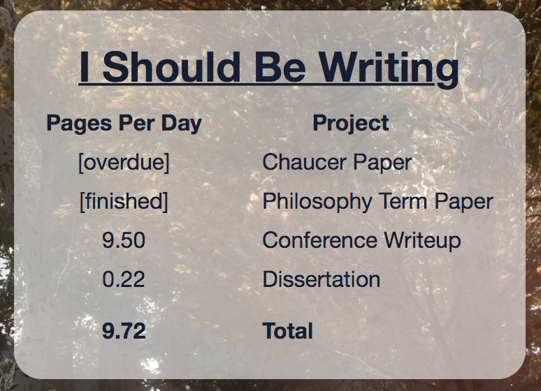

# I Should Be Writing

Because you really should. 



Calculates how many pages you should be writing per day based on your current due dates and how much as been written.

Reads an `~/.isbw` file that is a JSON file structured like the following example: 

```json
{
    "projects": [
        {
            "name": "Chaucer Paper",
            "total": 20,
            "written": 14,
            "due": "November 1, 2017"
        },
        {
            "name": "Philosophy Term Paper",
            "total": 40,
            "written": 43,
            "due": "December 15, 2017"
        },
        {
            "name": "Conference Writeup",
            "total": 30,
            "written": 11,
            "due": "November 5, 2017"
        },
        {
            "name": "Dissertation",
            "total": 200,
            "written": 160,
            "due": "May 6, 2018"
        }
    ]
}
```

Can also be run from the command line with `--ascii` or no flags at all. 

```
%> python ./isbw.py
  Pages            Project
  -----            -------
[overdue]       Chaucer Paper
[finished]  Philosophy Term Paper
   9.50      Conference Writeup
   0.22         Dissertation

   9.72             Total
```

## Installation

Requires Python and `virtualenv`. 

From the cloned directory:
```
%> virtualenv env
%> ./env/bin/pip install -r ./requirements.txt
%> ./env/bin/python ./isbw.py
```

You can also install the Übersicht widget (pictured above) by running: 

```
%> ./install_widget.zsh
```
